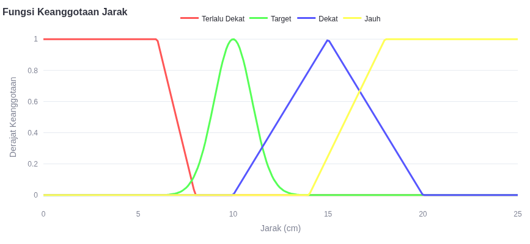
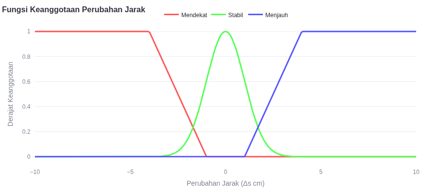

# 🤖 Fuzzy Logic Distance-Controlled Robot

A mini car project using fuzzy logic to maintain a stable distance (15 cm) from obstacles via an ultrasonic sensor (HC-SR04) and Sugeno inference.

## 📋 Table of Contents
- [Project Description](#-project-description)
- [Features](#-features)
- [Hardware Components](#-hardware-components)
- [Software Requirements](#-software-requirements)
- [Installation](#-installation)
- [Methodology](#-methodology)
- [Fuzzy Logic Setup](#-fuzzy-logic-setup)
- [Results](#-results)
- [Contributors](#-contributors)
- [References](#-references)

---

## 📝 Project Description
This project implements a fuzzy logic control system to autonomously regulate the movement of a mini car. The robot uses an ultrasonic sensor (HC-SR04) to measure distance and adjusts its speed/direction via PWM signals to DC motors. The system employs the Sugeno method for inference, ensuring efficient and adaptive control.

**Target**: Maintain a stable distance of **15 cm** from obstacles.

---

## 🚀 Features
- Real-time distance measurement using HC-SR04.
- Fuzzy logic-based decision-making (Sugeno method).
- Adaptive motor control (forward, backward, stop).
- Smooth defuzzification using weighted averages.

---

## 🔧 Hardware Components
- Arduino Uno
- HC-SR04 Ultrasonic Sensor
- L298N Motor Driver
- 2x DC Motors
- Mini Car Chassis
- Jumper Wires
- Power Supply (5V-12V)

---

## 💻 Software Requirements
- Arduino IDE
- `Arduino.h` and `math.h` libraries

---

## 🛠️ Installation
1. **Circuit Setup**:
   - Connect HC-SR04:
     - `TRIG` → Arduino Pin 2
     - `ECHO` → Arduino Pin 3
   - Connect L298N Motor Driver:
     - `IN1`, `IN2`, `IN3`, `IN4` → Arduino Pins 6, 7, 5, 4
     - `ENA`, `ENB` → Arduino Pins 9, 10
2. **Upload Code**:
   - Copy the provided code into a `.ino` file.
   - Upload to Arduino Uno via Arduino IDE.

---

## 📘 Methodology
### Fuzzy Logic Setup
#### Input Variables
1. **Distance (s)**:
   - Membership Functions:  
     - *Too Close* (s ≤ 8 cm)  
     - *Target* (10 cm)  
     - *Close* (10–20 cm)  
     - *Far* (s > 14 cm)  
   - Membership Functions Graph:  
       

2. **Delta Distance (Δs)**:
   - Membership Functions:  
     - *Approaching* (Δs < 0)  
     - *Stable* (Δs ≈ 0)  
     - *Moving Away* (Δs > 0)  
   - Membership Functions Graph:  
       

#### Output (PWM)
- Categories:  
  `-200` (⏪ Fast Backward), `-100` (⬅️ Slow Backward), `0` (🛑 Stop), `+50` (➡️ Slow Forward), `+100` (⏩ Forward), `+200` (🚀 Fast Forward).

#### Fuzzy Rules
| Rule | Distance       | Δs         | PWM   |
|------|----------------|------------|-------|
| 1    | Too Close      | Approaching| -200  |
| 2    | Too Close      | Stable     | -100  |
| 3    | Too Close      | Moving Away| 0     |
| 4    | Target         | Stable     | 0     |
| 5    | Target         | Approaching| -100  |
| 6    | Target         | Moving Away| +100  |
| 7    | Close          | Approaching| -100  |
| 8    | Close          | Stable     | 0     |
| 9    | Close          | Moving Away| +50   |
| 10   | Far            | Approaching| +100  |
| 11   | Far            | Stable     | +200  |
| 12   | Far            | Moving Away| +200  |

#### Defuzzification
- Weighted average:  
  `Output (PWM) = Σ(α_i × z_i) / Σ(α_i)`  
  where `α_i` = firing strength, `z_i` = rule output.

---

## 📊 Results
- The robot successfully maintains a stable distance of **15 cm** from obstacles.
- Smooth transitions between speed levels (no aggressive movements 🎯).
- Real-time responsiveness to environmental changes.

---

## 👥 Contributors
- Thoriq Putra Belligan
- Fajari Ani Novita Sari
- Muhammad Harits Naufal K
- Muhammad Adib Elfito
- M. Dafian Saputra Sinaga

---

## 📚 References
1. [Fuzzy Inference System (FIS) Sugeno - YouTube](https://www.youtube.com/watch?v=RjyRTBNk3w8)
2. [Sugeno Fuzzy Control for Automated Cars - CORE](https://core.ac.uk/download/pdf/230616389.pdf)
3. [MathWorks - Types of Fuzzy Inference Systems](https://www.mathworks.com/help/fuzzy/types-of-fuzzy-inference-systems.html)
4. [ScienceDirect - Takagi-Sugeno Fuzzy System](https://www.sciencedirect.com/topics/computer-science/takagi-sugeno-fuzzy-system)
